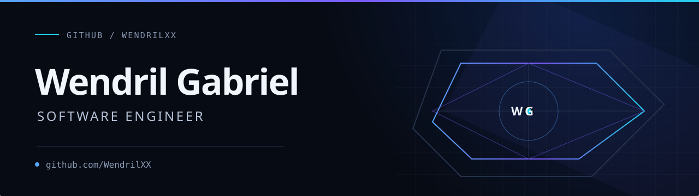

  <a href="./README.md">English</a> · <strong>Português</strong>

  

> Sou Wendril Gabriel, **Engenheiro de Software**. Este perfil reúne projetos públicos de software e explorações técnicas documentadas em repositórios.

Meus repositórios demonstram interesse em modelos de linguagem e geração aumentada por recuperação, incluindo explorações de Transformers, LoRA/QLoRA, DPO, tokenização e atenção.

## Sobre

- Publico projetos e experimentos técnicos como [`WendrilXX`](https://github.com/WendrilXX).
- Entre os repositórios públicos, não derivados de forks e com linguagem principal atribuída: Python (8), C# (2), PowerShell (1), Jupyter Notebook (1) e HTML (1).
- Os nomes dos repositórios documentam explorações de temas relacionados a LLMs e RAG; eles são apresentados como áreas de interesse e experimentação, não como alegações de especialização.

## Tecnologias e ferramentas

Tecnologias presentes nos repositórios públicos e na documentação ou nos dados de linguagem dos projetos selecionados abaixo.

**Linguagens e formatos de repositório**

**Desenvolvimento de jogos**

**Desenvolvimento web**

## Atividade no GitHub

  
  

  

## Projetos públicos selecionados

### [GhostBeam](https://github.com/WendrilXX/GhostBeam)

Um jogo de sobrevivência 2D para dispositivos móveis, desenvolvido com Unity 2023 LTS+, C#, URP 2D e TextMesh Pro. Os dados de linguagem do GitHub também identificam HTML, ShaderLab e HLSL no repositório.

### [Piac](https://github.com/WendrilXX/Piac)

Um sistema web de indicações e dashboard para uma empresa de engenharia. A stack documentada inclui React 18, Vite, Material UI v5, React Router v6, Recharts, React Hook Form e Yup; os dados de linguagem do GitHub identificam JavaScript e HTML.

## Contato

- [LinkedIn](https://www.linkedin.com/in/wendrilgabriel/)
- [GitHub](https://github.com/WendrilXX)

<!-- Adicione seu e-mail profissional aqui: mailto:... -->

---

  Wendril Gabriel · Engenheiro de Software · <a href="./README.md">Read in English</a>  
  

